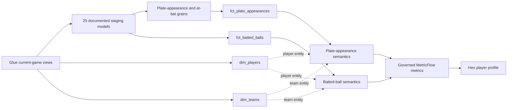

# Zavant semantic layer

This dbt project converts Glue-published current-game datasets into tested
business grains and a source-controlled MetricFlow semantic layer. Its central
design goal is that every published statistic remains correct when regrouped by
player, team, season, matchup, game state, or another supported dimension.

[Return to the project overview](../) ·
[Inspect the data platform](../docs/data-platform.md) ·
[Read the Hex methodology](../docs/hex-methodology.md)

## Semantic model



The presentation layer consumes semantic metrics rather than rebuilding
formulas in charts. Player and team entities make the same descriptive
dimensions available across both fact families.

## Business grains

| Model | Grain | Purpose |
|---|---|---|
| [`int_plate_appearances`](models/intermediate/plate_appearances/int_plate_appearances.sql) | One qualifying `game_pk`, `at_bat_index` | Isolates official batter turns from MLB's broader `allPlays` stream. |
| [`int_at_bats`](models/intermediate/at_bats/int_at_bats.sql) | One official at-bat | Applies official outcome exclusions without duplicating plate-appearance logic. |
| [`fct_plate_appearances`](models/marts/fct_plate_appearances.sql) | One `game_pk`, `at_bat_index` | Stores outcomes, participants, game state, additive indicators, and deterministic keys. |
| [`fct_batted_balls`](models/marts/fct_batted_balls.sql) | One `game_pk`, `at_bat_index`, `event_index` | Stores contact measurements, pitch context, tracking eligibility, and governed contact classifications. |
| [`dim_players`](models/marts/dim_players.sql) | One MLB player | Resolves a Type 1 player record from the most recently observed game context. |
| [`dim_teams`](models/marts/dim_teams.sql) | One MLB team | Resolves current team attributes from the latest unambiguous game observation. |

The fact grains use stable MLB identifiers plus source sequence indexes. Hash
keys are conveniences for joins and semantic entities; they do not replace the
documented natural grain.

## From event evidence to reusable metrics

MLB supplies atomic game events, official outcome classifications, and tracking
measurements. Zavant derives analytical flags and aggregates from those records.
It does not source the player-profile statistics from a pre-aggregated leaderboard.

```text
MLB play result
    -> dbt outcome indicators such as hit_ind, at_bat_ind, and walk_ind
    -> additive MetricFlow measures such as hits, at_bats, and walks
    -> governed ratios and derived metrics such as AVG, OBP, SLG, and OPS
    -> reusable Hex filters, tables, charts, and player-profile cards
```

Representative metric contracts are:

| Metric | Governed definition | Modeling reason |
|---|---|---|
| Batting average | `hits / at_bats` | Calculates a ratio of aggregate components instead of averaging row-level rates. |
| On-base percentage | `(hits + walks + hit_by_pitch) / (at_bats + walks + hit_by_pitch + sacrifice_flies)` | Preserves the official opportunity denominator at every query grain. |
| Slugging percentage | `total_bases / at_bats` | Keeps total bases additive before division. |
| On-base plus slugging | `on_base_percentage + slugging_percentage` | Reuses governed component metrics. |
| BABIP | `(hits - home_runs) / (at_bats - strikeouts - home_runs + sacrifice_flies)` | Defines balls-in-play eligibility explicitly. |
| Average exit velocity | `exit_velocity_sum / exit_velocity_tracked_batted_balls` | Weights regrouped averages by the number of tracked batted balls. |
| Hard-hit rate | `hard_hits / exit_velocity_tracked_batted_balls` | Excludes events for which MLB supplied no exit velocity. |
| Sweet-spot rate | `sweet_spots / launch_angle_tracked_batted_balls` | Excludes events for which MLB supplied no launch angle. |

The source-controlled definitions live in
[`metrics_plate_appearances.yml`](models/semantic/plate_appearances/metrics_plate_appearances.yml)
and
[`metrics_batted_balls.yml`](models/semantic/batted_balls/metrics_batted_balls.yml).
Their measures, dimensions, entities, and default time grains live beside them
in the corresponding `sem_*.yml` files.

## Correction-safe incremental facts

Glue owns source-revision resolution and presents one current revision of each
game to dbt. The incremental facts compare those current revision IDs with the
revision already materialized in the target table. For each changed game they:

1. Recompute the complete desired set of fact rows.
2. Merge new and updated keys into the Iceberg table.
3. Emit a deletion set for target rows that belonged to the changed game but
   no longer exist in its new source revision.
4. Leave every unchanged game untouched.

This game-replacement boundary handles corrections that add, change, or remove
events without requiring a full-table rebuild and without leaving obsolete
rows behind.

## Quality and reconciliation

The project combines generic grain tests with domain-specific singular tests:

- [`plate_appearance_fact_reconciles_to_boxscore.sql`](tests/plate_appearance_fact_reconciles_to_boxscore.sql)
  compares event-derived player-game totals with MLB's separately projected
  boxscore section.
- [`plate_appearance_fact_uses_current_revision.sql`](tests/plate_appearance_fact_uses_current_revision.sql)
  verifies that the incremental fact contains the revision selected by Glue.
- [`batted_ball_fact_uses_current_revision.sql`](tests/batted_ball_fact_uses_current_revision.sql)
  applies the same correction invariant to contact events.
- [`batted_balls_have_pitch.sql`](tests/batted_balls_have_pitch.sql) and the
  other relationship tests protect joins across event grains.
- Model contracts document grain columns and data types, while uniqueness and
  required-key tests enforce only constraints that downstream joins depend on.

Together, these checks demonstrate both internal model consistency and
independent reconciliation to another section of the retained source response.

## Project structure

```text
models/
├── staging/       # one documented current-state view per analytical dataset
├── intermediate/  # reusable grain qualification and sequence logic
├── marts/         # dimensions and correction-safe Iceberg facts
└── semantic/      # MetricFlow entities, dimensions, measures, and metrics
tests/             # cross-model, current-revision, and boxscore reconciliation
```

Breaking analytical projection releases rebuild the analytical tables and
dependent dbt models together. dbt therefore consumes one compatible projection
generation rather than attempting to union incompatible schemas.

## Local development

Connection credentials and developer-specific targets belong in
`~/.dbt/profiles.yml` and are not committed. From the repository root:

```shell
make bootstrap
make dbt-debug
make check
```

The warehouse-backed checks remain explicit because they execute Athena queries
and materialize development relations:

```shell
make dbt-staging-build
make dbt-source-freshness
```

After changing `packages.yml`, run `make dbt-deps`. MetricFlow is installed in
the project environment and its manifest is validated as part of the standard
quality loop.
