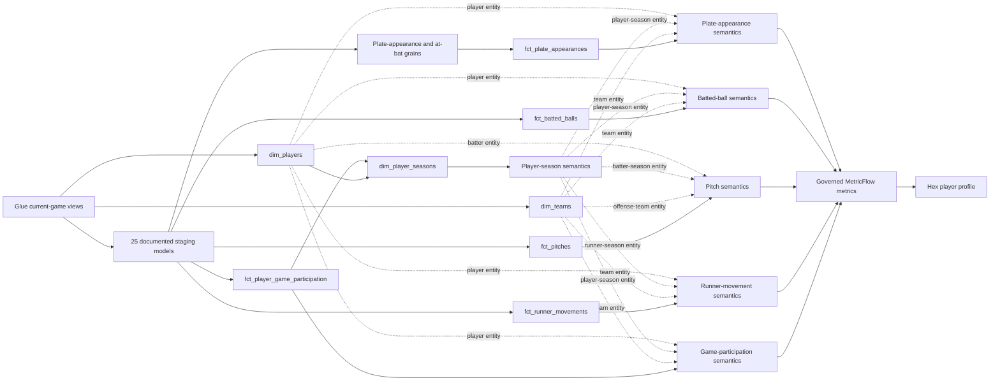

# Zavant semantic layer

This dbt project converts Glue-published current-game datasets into tested
business grains and a source-controlled MetricFlow semantic layer. Its central
design goal is that every published statistic remains correct when regrouped by
player, team, season, matchup, game state, or another supported dimension.

[Return to the project overview](../readme.md) ·
[Inspect the data platform](../docs/data-platform.md) ·
[Read the Hex methodology](../docs/hex-methodology.md) ·
[Open the published Hex player profile](https://app.hex.tech/01a00124-662e-7369-982a-ba58e4f2a22f/app/0347rXGBaRqd4gD8KHxHRr/latest)

## Semantic model



The presentation layer consumes semantic metrics rather than rebuilding
formulas in charts. Player, player-season, and team entities make the same
descriptive dimensions available across the supported fact families. The
player-season entity exposes baseball age using the June 30 season-age
convention without copying the calculation into each fact.

## Business grains

| Model | Grain | Purpose |
|---|---|---|
| [`int_plate_appearances`](models/intermediate/plate_appearances/int_plate_appearances.sql) | One qualifying `game_pk`, `at_bat_index` | Isolates official batter turns from MLB's broader `allPlays` stream. |
| [`int_at_bats`](models/intermediate/at_bats/int_at_bats.sql) | One official at-bat | Applies official outcome exclusions without duplicating plate-appearance logic. |
| [`fct_plate_appearances`](models/marts/fct_plate_appearances.sql) | One `game_pk`, `at_bat_index` | Stores outcomes, participants, game state, additive indicators, and Savant values used by plate-appearance metrics. |
| [`fct_batted_balls`](models/marts/fct_batted_balls.sql) | One `game_pk`, `at_bat_index`, `event_index` | Stores contact measurements, pitch context, tracking eligibility, and governed contact classifications. |
| [`fct_pitches`](models/marts/fct_pitches.sql) | One `game_pk`, `at_bat_index`, `event_index` | Stores every actual pitch, including pitches outside completed plate appearances, with pre-pitch count, pitch family, result, and tracking context. |
| [`fct_runner_movements`](models/marts/fct_runner_movements.sql) | One `game_pk`, `at_bat_index`, `runner_index` | Stores runner-specific advances, runs, outs, basestealing outcomes, and optional pitch context. |
| [`fct_player_game_participation`](models/marts/fct_player_game_participation.sql) | One `game_pk`, `player_id`, `team_id` | Preserves team-level participation while supporting deduplicated player-game counts. |
| [`dim_players`](models/marts/dim_players.sql) | One MLB player | Resolves a Type 1 player record from the most recently observed game context. |
| [`dim_player_seasons`](models/marts/dim_player_seasons.sql) | One `player_id`, `season` | Identifies seasons with observed game participation and calculates baseball age on June 30. |
| [`dim_teams`](models/marts/dim_teams.sql) | One MLB team | Resolves current team attributes from the latest unambiguous game observation. |

The fact grains use stable MLB identifiers plus source sequence indexes. Hash
keys are conveniences for joins and semantic entities; they do not replace the
documented natural grain.

## From event evidence to reusable metrics

MLB supplies atomic game events, official outcome classifications, and tracking
measurements. Zavant derives analytical flags and aggregates from those records.
It does not source the player-profile statistics from a pre-aggregated leaderboard.

```text
MLB play result
    -> dbt outcome indicators such as hit_ind, at_bat_ind, and walk_ind
    -> additive MetricFlow measures such as hits, at_bats, and walks
    -> governed ratios and derived metrics such as AVG, OBP, SLG, and OPS
    -> reusable Hex filters, tables, charts, and player-profile cards
```

Representative metric contracts are:

| Metric | Governed definition | Modeling reason |
|---|---|---|
| Batting average | `hits / at_bats` | Calculates a ratio of aggregate components instead of averaging row-level rates. |
| On-base percentage | `(hits + walks + hit_by_pitch) / (at_bats + walks + hit_by_pitch + sacrifice_flies)` | Preserves the official opportunity denominator at every query grain. |
| Slugging percentage | `total_bases / at_bats` | Keeps total bases additive before division. |
| Expected batting average | `expected_hits / at_bats` | Keeps Savant contact probabilities additive while strikeout at-bats remain in the denominator. |
| Expected slugging percentage | `expected_total_bases / at_bats` | Calculates the player rate from additive Savant total-base expectations. |
| Barrels per plate appearance | Average of the PA-grain `barrel_ind` | Keeps the numerator and denominator on the plate-appearance dataset accepted by Hex. |
| On-base plus slugging | `on_base_percentage + slugging_percentage` | Reuses governed component metrics. |
| BABIP | `(hits - home_runs) / (at_bats - strikeouts - home_runs + sacrifice_flies)` | Defines balls-in-play eligibility explicitly. |
| Average exit velocity | `exit_velocity_sum / exit_velocity_tracked_batted_balls` | Weights regrouped averages by the number of tracked batted balls. |
| Hard-hit rate | `hard_hits / exit_velocity_tracked_batted_balls` | Excludes events for which MLB supplied no exit velocity. |
| Sweet-spot rate | `sweet_spots / launch_angle_tracked_batted_balls` | Excludes events for which MLB supplied no launch angle. |
| Pitches | Count of rows in `fct_pitches` | Counts the pitch event stream directly rather than summing only pitches attached to completed plate appearances. |
| Fastball pitch rate | `fastball_pitches / pitches` | Preserves pitch-family membership as additive components before division. |
| Average release velocity | `release_velocity_sum / velocity_tracked_pitches` | Weights regrouped velocity by the number of pitches with a supplied measurement. |

The source-controlled definitions live in
[`metrics_plate_appearances.yml`](models/semantic/plate_appearances/metrics_plate_appearances.yml)
and
[`metrics_batted_balls.yml`](models/semantic/batted_balls/metrics_batted_balls.yml),
and
[`metrics_pitches.yml`](models/semantic/pitches/metrics_pitches.yml), with game
participation and baserunning definitions in their neighboring semantic-model
directories.
Their measures, dimensions, entities, and default time grains live beside them
in the corresponding `sem_*.yml` files.

## Correction-safe incremental facts

Glue owns source-revision resolution and presents one current revision of each
game and Savant date to dbt. Single-source incremental facts compare the current
Stats API game revision with the revision already materialized in the target.
Combined facts compare the complete Stats API and Savant revision tuple. For
each changed game they:

1. Recompute the complete desired set of fact rows.
2. Merge new and updated keys into the Iceberg table.
3. Emit a deletion set for target rows that belonged to the changed game but
   no longer exist in its new source revision.
4. Leave every unchanged game untouched.

This game-replacement boundary handles corrections from either source that add,
change, or remove events or enrichments without requiring a full-table rebuild
and without leaving obsolete rows behind. A changed date-scoped Savant revision
recalculates every game represented by that revision.

The documented
[`correction_safe_incremental.sql`](macros/correction_safe_incremental.sql)
macros centralize changed-game selection and deletion-set generation while
leaving each model's business-grain SQL visible for review and debugging.

## Quality and reconciliation

The project combines generic grain tests with domain-specific singular tests:

- [`plate_appearance_fact_reconciles_to_boxscore.sql`](tests/plate_appearance_fact_reconciles_to_boxscore.sql)
  compares event-derived player-game totals with MLB's separately projected
  boxscore section.
- [`plate_appearance_fact_uses_current_revision.sql`](tests/plate_appearance_fact_uses_current_revision.sql)
  verifies the Stats API side of the plate-appearance revision tuple, while
  [`plate_appearance_fact_uses_current_savant_revision.sql`](tests/plate_appearance_fact_uses_current_savant_revision.sql)
  verifies the Savant side.
- [`plate_appearance_fact_matches_statcast_batting_values.sql`](tests/plate_appearance_fact_matches_statcast_batting_values.sql)
  verifies that plate-appearance expected-stat inputs and barrel classification
  retain Savant's terminal-outcome values.
- [`batted_ball_fact_uses_current_revision.sql`](tests/batted_ball_fact_uses_current_revision.sql)
  verifies the Stats API side of the contact-event revision tuple, while
  [`batted_ball_fact_uses_current_savant_revision.sql`](tests/batted_ball_fact_uses_current_savant_revision.sql)
  verifies the Savant side.
- [`batted_ball_fact_matches_statcast_expected_statistics.sql`](tests/batted_ball_fact_matches_statcast_expected_statistics.sql)
  and [`batted_ball_fact_matches_statcast_barrel_classification.sql`](tests/batted_ball_fact_matches_statcast_barrel_classification.sql)
  verify that the fact preserves Savant's expected values and authoritative
  barrel classification.
- [`statcast_batting_events_use_current_date_revision.sql`](tests/statcast_batting_events_use_current_date_revision.sql)
  verifies projected outcomes agree with the authoritative date-revision
  mapping used by the combined incremental selector.
- [`pitch_fact_reconciles_to_staging.sql`](tests/pitch_fact_reconciles_to_staging.sql)
  verifies that the pitch fact preserves the complete actual-pitch event stream.
- [`pitch_fact_uses_current_revision.sql`](tests/pitch_fact_uses_current_revision.sql)
  applies game-replacement revision safety to pitches.
- [`batted_balls_have_pitch.sql`](tests/batted_balls_have_pitch.sql) and the
  other relationship tests protect joins across event grains.
- Model contracts document grain columns and data types, while uniqueness and
  required-key tests enforce only constraints that downstream joins depend on.

Together, these checks demonstrate both internal model consistency and
independent reconciliation to another section of the retained source response.

## Project structure

```text
models/
├── staging/       # one documented current-state view per analytical dataset
├── intermediate/  # reusable grain qualification and sequence logic
├── marts/         # dimensions and correction-safe Iceberg facts
└── semantic/      # MetricFlow entities, dimensions, measures, and metrics
tests/             # cross-model, current-revision, and boxscore reconciliation
```

Breaking analytical projection releases rebuild the analytical tables and
dependent dbt models together. dbt therefore consumes one compatible projection
generation rather than attempting to union incompatible schemas.

## Local development

Connection credentials and developer-specific targets belong in
`~/.dbt/profiles.yml` and are not committed. From the repository root:

```shell
make bootstrap
make dbt-debug
make check
```

The warehouse-backed checks remain explicit because they execute Athena queries
and materialize development relations:

```shell
make dbt-staging-build
make dbt-source-freshness
```

After changing `packages.yml`, run `make dbt-deps`. MetricFlow is installed in
the project environment, and `make dbt-semantic-validate` runs its semantic
validator with data-warehouse validation disabled. That target is also part of
`make check`. MetricFlow initializes the configured dbt adapter and connection
before validation, but it does not run its warehouse validation suite.
