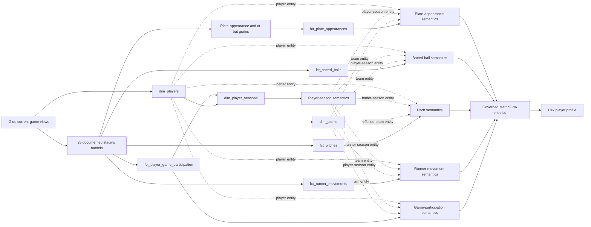

# Zavant semantic layer

This dbt project converts Glue-published current-game datasets into tested
business grains and a source-controlled MetricFlow semantic layer. Its central
design goal is that every published statistic remains correct when regrouped by
player, team, season, matchup, game state, or another supported dimension.

[Return to the project overview](../readme.md) ·
[Inspect the data platform](../docs/data-platform.md) ·
[Read the Hex methodology](../docs/hex-methodology.md) ·
[Open the published Hex player profile](https://app.hex.tech/01a00124-662e-7369-982a-ba58e4f2a22f/app/0347rXGBaRqd4gD8KHxHRr/latest)

## Semantic model


```mermaid
flowchart LR
    current[Glue current-game views]
    staging[25 documented staging models]
    pa_int[Plate-appearance and at-bat grains]
    players[dim_players]
    player_seasons[dim_player_seasons]
    teams[dim_teams]
    pa_fact[fct_plate_appearances]
    bb_fact[fct_batted_balls]
    pitch_fact[fct_pitches]
    rm_fact[fct_runner_movements]
    gp_fact[fct_player_game_participation]
    pa_sem[Plate-appearance semantics]
    bb_sem[Batted-ball semantics]
    pitch_sem[Pitch semantics]
    rm_sem[Runner-movement semantics]
    gp_sem[Game-participation semantics]
    player_season_sem[Player-season semantics]
    metrics[Governed MetricFlow metrics]
    hex[Hex player profile]

    current --> staging
    current --> players
    current --> teams
    staging --> pa_int
    pa_int --> pa_fact
    staging --> bb_fact
    staging --> pitch_fact
    staging --> rm_fact
    staging --> gp_fact
    gp_fact --> player_seasons
    players --> player_seasons
    players -. player entity .-> pa_sem
    players -. player entity .-> bb_sem
    players -. batter entity .-> pitch_sem
    players -. player entity .-> rm_sem
    players -. player entity .-> gp_sem
    player_seasons --> player_season_sem
    player_season_sem -. player-season entity .-> pa_sem
    player_season_sem -. player-season entity .-> bb_sem
    player_season_sem -. batter-season entity .-> pitch_sem
    player_season_sem -. runner-season entity .-> rm_sem
    player_season_sem -. player-season entity .-> gp_sem
    teams -. team entity .-> pa_sem
    teams -. team entity .-> bb_sem
    teams -. offense-team entity .-> pitch_sem
    teams -. team entity .-> rm_sem
    teams -. team entity .-> gp_sem
    pa_fact --> pa_sem
    bb_fact --> bb_sem
    pitch_fact --> pitch_sem
    rm_fact --> rm_sem
    gp_fact --> gp_sem
    pa_sem --> metrics
    bb_sem --> metrics
    pitch_sem --> metrics
    rm_sem --> metrics
    gp_sem --> metrics
    metrics --> hex
```

The presentation layer consumes semantic metrics rather than rebuilding
formulas in charts. Player, player-season, and team entities make the same
descriptive dimensions available across the supported fact families. The
player-season entity exposes baseball age using the June 30 season-age
convention without copying the calculation into each fact.

## Business grains

| Model | Grain | Purpose |
|---|---|---|
| [`int_plate_appearances`](models/intermediate/plate_appearances/int_plate_appearances.sql) | One qualifying `game_pk`, `at_bat_index` | Isolates official batter turns from MLB's broader `allPlays` stream. |
| [`int_at_bats`](models/intermediate/at_bats/int_at_bats.sql) | One official at-bat | Applies official outcome exclusions without duplicating plate-appearance logic. |
| [`fct_plate_appearances`](models/marts/fct_plate_appearances.sql) | One `game_pk`, `at_bat_index` | Stores outcomes, participants, game state, additive indicators, and Savant values used by plate-appearance metrics. |
| [`fct_batted_balls`](models/marts/fct_batted_balls.sql) | One `game_pk`, `at_bat_index`, `event_index` | Stores contact measurements, pitch context, tracking eligibility, and governed contact classifications. |
| [`fct_pitches`](models/marts/fct_pitches.sql) | One `game_pk`, `at_bat_index`, `event_index` | Stores every actual pitch, including pitches outside completed plate appearances, with pre-pitch count, pitch family, result, and tracking context. |
| [`fct_runner_movements`](models/marts/fct_runner_movements.sql) | One `game_pk`, `at_bat_index`, `runner_index` | Stores runner-specific advances, runs, outs, basestealing outcomes, and optional pitch context. |
| [`fct_player_game_participation`](models/marts/fct_player_game_participation.sql) | One `game_pk`, `player_id`, `team_id` | Preserves team-level participation while supporting deduplicated player-game counts. |
| [`dim_players`](models/marts/dim_players.sql) | One MLB player | Resolves a Type 1 player record from the most recently observed game context. |
| [`dim_player_seasons`](models/marts/dim_player_seasons.sql) | One `player_id`, `season` | Identifies seasons with observed game participation and calculates baseball age on June 30. |
| [`dim_teams`](models/marts/dim_teams.sql) | One MLB team | Resolves current team attributes from the latest unambiguous game observation. |

The fact grains use stable MLB identifiers plus source sequence indexes. Hash
keys are conveniences for joins and semantic entities; they do not replace the
documented natural grain.

## From event evidence to reusable metrics

MLB supplies atomic game events, official outcome classifications, and tracking
measurements. Zavant derives analytical flags and aggregates from those records.
It does not source the player-profile statistics from a pre-aggregated leaderboard.

```text
MLB play result
    -> dbt outcome indicators such as hit_ind, at_bat_ind, and walk_ind
    -> additive MetricFlow measures such as hits, at_bats, and walks
    -> governed ratios and derived metrics such as AVG, OBP, SLG, and OPS
    -> reusable Hex filters, tables, charts, and player-profile cards
```

Representative metric contracts are:

| Metric | Governed definition | Modeling reason |
|---|---|---|
| Batting average | `hits / at_bats` | Calculates a ratio of aggregate components instead of averaging row-level rates. |
| On-base percentage | `(hits + walks + hit_by_pitch) / (at_bats + walks + hit_by_pitch + sacrifice_flies)` | Preserves the official opportunity denominator at every query grain. |
| Slugging percentage | `total_bases / at_bats` | Keeps total bases additive before division. |
| Expected batting average | `expected_hits / expected_batting_average_at_bats` | Includes official strikeout at-bats and contact at-bats with supplied hit probabilities; missing contact estimates are not zero-value outs. |
| Expected slugging percentage | `expected_total_bases / expected_slugging_at_bats` | Uses its own total-base-estimate coverage, including strikeouts and supplied zero estimates. |
| Expected weighted on-base average | `expected_woba_numerator / woba_denominator` | Includes Savant's eligible contact and non-contact outcomes. |
| Weighted on-base average | `woba_numerator / woba_opportunities` | Uses season-specific FanGraphs weights and official AB + unintentional BB + HBP + SF, independently of Savant coverage. |
| Expected wOBA on contact | `expected_woba_on_contact_numerator / expected_woba_on_contact_observations` | Restricts both components to batted balls with a supplied expected wOBA value; true zero estimates remain eligible. |
| Barrels per plate appearance | Average of the PA-grain `barrel_ind` | Keeps the numerator and denominator on the plate-appearance dataset accepted by Hex. |
| On-base plus slugging | `on_base_percentage + slugging_percentage` | Reuses governed component metrics. |
| BABIP | `(hits - home_runs) / (at_bats - strikeouts - home_runs + sacrifice_flies)` | Defines balls-in-play eligibility explicitly. |
| Average exit velocity | `exit_velocity_sum / exit_velocity_tracked_batted_balls` | Uses Savant values, including supplied estimates, and excludes null observations. |
| Barrel rate | `barrels / statsapi_contact_observations` | Uses original Stats API contact coverage as an observed-contact proxy, not all BBE or Savant-expanded coverage. |
| Hard-hit rate | `hard_hits / batted_ball_events` | Uses Savant velocity for classification; all BBE remain in the denominator. |
| Sweet-spot rate | `sweet_spots / statsapi_launch_angle_observations` | Retains the original Stats API inputs, inclusive boundaries, and denominator while reconciliation is deferred. |
| Pitches | Count of rows in `fct_pitches` | Counts the pitch event stream directly rather than summing only pitches attached to completed plate appearances. |
| Fastball pitch rate | `fastball_pitches / pitches` | Preserves pitch-family membership as additive components before division. |
| Average release velocity | `release_velocity_sum / velocity_tracked_pitches` | Weights regrouped velocity by the number of pitches with a supplied measurement. |

The source-controlled definitions live in
[`metrics_plate_appearances.yml`](models/semantic/plate_appearances/metrics_plate_appearances.yml)
and
[`metrics_batted_balls.yml`](models/semantic/batted_balls/metrics_batted_balls.yml),
and
[`metrics_pitches.yml`](models/semantic/pitches/metrics_pitches.yml), with game
participation and baserunning definitions in their neighboring semantic-model
directories.
Their measures, dimensions, entities, and default time grains live beside them
in the corresponding `sem_*.yml` files.

### Statcast batting-table columns

The columns after Sweet-Spot Rate use these semantic metrics. Select the same
player and season population across the PA and batted-ball datasets; aggregate
each fact independently rather than joining raw fact rows and multiplying PAs.

| Display column | Metric name | Semantic model |
|---|---|---|
| xBA | `expected_batting_average` | `plate_appearances` |
| xSLG | `expected_slugging_percentage` | `plate_appearances` |
| wOBA | `weighted_on_base_average` | `plate_appearances` |
| xwOBA | `expected_weighted_on_base_average` | `plate_appearances` |
| xwOBAcon | `expected_weighted_on_base_average_on_contact` | `batted_balls` |
| HardHit% | `hard_hit_rate` | `batted_balls` |
| K% | `strikeout_rate` | `plate_appearances` |
| BB% | `walk_rate` | `plate_appearances` |

xBA, xSLG, wOBA, xwOBA, and xwOBAcon are decimal statistics, normally displayed to
three decimal places. HardHit%, K%, and BB% are fractions formatted as
percentages, not values multiplied by 100 in the semantic layer.

xwOBAcon is contact-only: home runs and supplied sacrifice-contact estimates
remain eligible, while walks, hit-by-pitches, and strikeouts are absent from
the batted-ball fact. Missing expected values are excluded from both components;
zero-valued estimates count. This differs from PA-level xwOBA, which includes
eligible non-contact outcomes using Savant's `woba_denom`. Both definitions
use [Savant's event fields](https://baseballsavant.mlb.com/csv-docs), not the
precomputed player-page aggregates. Exact page parity is not guaranteed.

Observed wOBA uses [`woba_weights.csv`](seeds/woba_weights.csv), with one set of
FanGraphs coefficients per season, and official Stats API batting outcomes.
It does not average Savant's generic `woba_value` research values, credit errors
or fielder's choices as hits, or use the Savant denominator retained for xwOBA.
The 2026 reference is provisional. See [reference maintenance and first
deployment](seeds/README.md) for provenance, incremental invalidation, and the
one-time PA fact full refresh required to add the new columns.

The xwOBAcon addition is semantic-only and uses an existing fact column; it
does not require an acquisition, Glue run, or fact full refresh. Validate the
definitions and refresh the Hex semantic project before selecting the metric.

### Contact-source and denominator correction

`fct_batted_balls.launch_speed` and `launch_angle` now come from Savant,
including its supplied estimates for some untracked events. Missing Savant
values stay null; there is no silent fallback to the Stats API. The original
values remain in `statsapi_launch_speed` and `statsapi_launch_angle` for
observed-contact eligibility and auditability. Availability flags now describe
the Savant values, so `statcast_tracking_rate` includes supplied estimates and
must not be interpreted as the directly measured share.

Sweet-spot classification deliberately still uses the original Stats API angle,
and its denominator counts that same original column. The new denominator
name preserves existing results; it is not a sweet-spot correction. See the
[remaining reconciliation limits](../docs/hex-methodology.md#remaining-savant-reconciliation)
for the unresolved boundary/precision question and other small discrepancies.

For xBA and xSLG, only official at-bats contribute. Strikeouts count as zero
expected production and one opportunity, even without Savant estimates.
Other at-bats require the corresponding estimate, including true zero values;
walks and sacrifices do not enter either component. These semantic-only changes
do not alter the PA fact or observed wOBA/xwOBA calculations.

**First deployment:** the batted-ball fact needs a full refresh, both to add the
two source-audit columns and to recompute history. Source revisions alone do
not invalidate existing games when model logic changes, and the incremental
merge cannot mix the old and new column layouts. Pause the local Dagster sensor
and let active/queued builds finish before running this against production:

```bash
.venv/bin/dbt build --project-dir dbt --target prod --full-refresh --select fct_batted_balls
```

This assumes upstream staging/intermediate relations are already current. Use
`--target dev` to migrate the development fact separately. No acquisition or
Glue rerun is required, and `fct_plate_appearances` does not need a full refresh
for these corrections. Refresh/sync the Hex semantic project **after** the fact
rebuild succeeds, rerun the existing pivots, and republish the app. Public metric
names are unchanged, so the pivot-join SQL does not need to change. Reload
Dagster's code location after updating the definitions.

## Correction-safe incremental facts

Glue owns source-revision resolution and presents one current revision of each
game and Savant date to dbt. Single-source incremental facts compare the current
Stats API game revision with the revision already materialized in the target.
Combined facts compare the complete Stats API and Savant revision tuple. For
each changed game they:

1. Recompute the complete desired set of fact rows.
2. Merge new and updated keys into the Iceberg table.
3. Emit a deletion set for target rows that belonged to the changed game but
   no longer exist in its new source revision.
4. Leave every unchanged game untouched.

This game-replacement boundary handles corrections from either source that add,
change, or remove events or enrichments without requiring a full-table rebuild
and without leaving obsolete rows behind. A changed date-scoped Savant revision
recalculates every game represented by that revision.

The PA fact additionally compares `woba_weights_revision`: updating a season's
coefficients or provisional status replaces that season's existing rows on the
next build. The reference pre-hook validates season coverage before writing.
This does not make arbitrary model-logic changes automatically incremental-safe.

The documented
[`correction_safe_incremental.sql`](macros/correction_safe_incremental.sql)
macros centralize changed-game selection and deletion-set generation while
leaving each model's business-grain SQL visible for review and debugging.

## Quality and reconciliation

[`dbt_project.yml`](dbt_project.yml) sets `flags.indirect_selection: buildable`
for both terminal commands and Dagster. Subset builds run tests whose inputs
are selected models or their upstream ancestors, rather than pulling in tests
against unselected downstream facts. For example, Savant staging builds defer
fact-to-Savant comparisons until the combined facts are built. This controls
test selection, not upstream freshness; existing upstream relations must still
be usable. Explicit CLI/environment overrides take precedence over this default.

The project combines generic grain tests with domain-specific singular tests:

- [`plate_appearance_fact_reconciles_to_boxscore.sql`](tests/plate_appearance_fact_reconciles_to_boxscore.sql)
  compares event-derived player-game totals with MLB's separately projected
  boxscore section.
- [`plate_appearance_fact_uses_current_revision.sql`](tests/plate_appearance_fact_uses_current_revision.sql)
  verifies the Stats API side of the plate-appearance revision tuple, while
  [`plate_appearance_fact_uses_current_savant_revision.sql`](tests/plate_appearance_fact_uses_current_savant_revision.sql)
  verifies the Savant side.
- [`plate_appearance_fact_matches_statcast_batting_values.sql`](tests/plate_appearance_fact_matches_statcast_batting_values.sql)
  verifies that plate-appearance expected-stat inputs and barrel classification
  retain Savant's terminal-outcome values.
- [`batted_ball_fact_uses_current_revision.sql`](tests/batted_ball_fact_uses_current_revision.sql)
  verifies the Stats API side of the contact-event revision tuple, while
  [`batted_ball_fact_uses_current_savant_revision.sql`](tests/batted_ball_fact_uses_current_savant_revision.sql)
  verifies the Savant side.
- [`batted_ball_fact_matches_statcast_expected_statistics.sql`](tests/batted_ball_fact_matches_statcast_expected_statistics.sql)
  and [`batted_ball_fact_matches_statcast_barrel_classification.sql`](tests/batted_ball_fact_matches_statcast_barrel_classification.sql)
  verify that the fact preserves Savant's expected values and authoritative
  barrel classification.
- [`statcast_batting_events_use_current_date_revision.sql`](tests/statcast_batting_events_use_current_date_revision.sql)
  verifies projected outcomes agree with the authoritative date-revision
  mapping used by the combined incremental selector.
- [`pitch_fact_reconciles_to_staging.sql`](tests/pitch_fact_reconciles_to_staging.sql)
  verifies that the pitch fact preserves the complete actual-pitch event stream.
- [`pitch_fact_uses_current_revision.sql`](tests/pitch_fact_uses_current_revision.sql)
  applies game-replacement revision safety to pitches.
- [`batted_balls_have_pitch.sql`](tests/batted_balls_have_pitch.sql) and the
  other relationship tests protect joins across event grains.
- Model contracts document grain columns and data types, while uniqueness and
  required-key tests enforce only constraints that downstream joins depend on.

Together, these checks demonstrate both internal model consistency and
independent reconciliation to another section of the retained source response.

### Historical batting-outcome normalization

The retained MLB responses are not always internally consistent. dbt applies
two narrow corrections without changing raw S3 objects or Glue-published data:

- [`stg_plays`](models/staging/stg_plays.sql) recovers a reviewed `game_advisory`
  only for a final game with exactly one batter movement from home that records
  an out at first as `field_out` or `grounded_into_double_play`. Its `event`,
  `event_type`, `is_complete`, and `is_out` then describe that batting outcome.
  The original values remain in `reported_*` columns and
  `is_batting_outcome_recovered` marks the correction. Rain delays, unfinished
  games, unrelated runner outs, and ambiguous evidence are not reclassified.
- [`batter_first_base_awards`](macros/batting_outcomes.sql) shares the at-bat
  exclusion rule between `int_at_bats` and `fct_plate_appearances`. Interference
  and defensive-shift credits must belong to the batter's movement from home
  to first. A credit affecting another runner or advancement beyond first does
  not remove the batter's at-bat or label their batting outcome interference.

For example, game `448816`, play `26` contains an ordinary Tim Beckham
reached-on-error and an interference credit on Steven Souza Jr.'s advancement.
It remains an at-bat. Games `490101` (play `76`, Ryan Braun) and `490136`
(play `72`, Kolten Wong) contain reviewed game-ending outs mislabeled as
advisories. Their reported boxscore PA counts also omit those plays despite
including their ABs.

Player and team batting staging models correct a reported PA shortfall only
when the recovered-out count exactly explains the difference from
`AB + BB + HBP + SH + SF + catcher interference`. Intentional walks are already
included in BB. Missing components do not qualify for correction. Both models
retain `reported_plate_appearances` and set
`plate_appearances_correction_reason = 'recovered_reviewed_batter_out'` only
when a correction was applied. There are no game-ID exceptions or test skips.
The [boxscore consistency test](tests/boxscore_batting_plate_appearances_are_consistent.sql)
fails remaining PA shortfalls; the existing reconciliation tests stay intact.

Offline regression tests execute the model SELECTs over minimal retained-game
fixtures and negative cases:

```shell
.venv/bin/python -m unittest tests.test_batting_outcome_normalization -v
```

After deploying changes to these rules, rebuild existing incremental facts:
their revision selectors detect source changes, not model-logic changes. Pause
the Dagster monitor and let active/queued runs finish before doing a manual
production rebuild; do not overlap writes to the same Iceberg tables.

```shell
.venv/bin/dbt build --project-dir dbt --target prod --full-refresh
```

## Project structure

```text
models/
├── staging/       # one documented current-state view per analytical dataset
├── intermediate/  # reusable grain qualification and sequence logic
├── marts/         # dimensions and correction-safe Iceberg facts
└── semantic/      # MetricFlow entities, dimensions, measures, and metrics
tests/             # cross-model, current-revision, and boxscore reconciliation
seeds/             # versioned annual wOBA coefficients and provenance
```

Breaking analytical projection releases rebuild the analytical tables and
dependent dbt models together. dbt therefore consumes one compatible projection
generation rather than attempting to union incompatible schemas.

## Local development

Connection credentials and developer-specific targets belong in
`~/.dbt/profiles.yml` and are not committed. From the repository root:

```shell
make bootstrap
make dbt-debug
make check
```

The warehouse-backed checks remain explicit because they execute Athena queries
and materialize development relations:

```shell
make dbt-staging-build
make dbt-source-freshness
```

After changing `packages.yml`, run `make dbt-deps`. MetricFlow is installed in
the project environment, and `make dbt-semantic-validate` runs its semantic
validator with data-warehouse validation disabled. That target is also part of
`make check`. MetricFlow initializes the configured dbt adapter and connection
before validation, but it does not run its warehouse validation suite.
