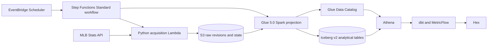

# Zavant data platform

Zavant operates a revision-aware MLB data pipeline in AWS and preserves enough
evidence to explain how every analytical row entered the system. The platform
supports daily incremental acquisition, correction reconciliation, deferred
games, deterministic local runs, and resumable historical backfills.

[Return to the project overview](../readme.md) ·
[Review the semantic layer](../dbt/) ·
[Browse the Python source](../src/zavant/) ·
[Browse the infrastructure](../infrastructure/) ·
[Open the published Hex player profile](https://app.hex.tech/01a00124-662e-7369-982a-ba58e4f2a22f/app/0347rXGBaRqd4gD8KHxHRr/latest)

## Production topology



The state machine retains an acquisition error, still runs Glue so successfully
landed revisions are not stranded, and then restores the acquisition failure as
the execution's final status. Glue failures remain retriable because incomplete
revisions never reach the `games` table that serves as the projection completion
marker.

## Daily acquisition

The daily Lambda composes four independently recorded branches:

1. **Correction discovery** polls MLB's game-change feed from a durable
   success-only watermark with a safety overlap.
2. **Correction processing** re-downloads changed games that already belong to
   the retained portfolio.
3. **Deferred-game processing** revisits unfinished regular-season games until
   they become final or cancelled.
4. **Schedule discovery** advances through the current date, uses a rolling
   lookback for recent schedule changes, and acquires newly eligible games.

Each branch records its own outcome. A partial failure does not roll back an
independent successful checkpoint, and an immediate rerun retries only work
that remains outstanding. The coordinator persists a durable manifest linking
the evidence for the complete daily attempt.

Representative source:

- [`daily.py`](../src/zavant/acquisition/daily.py) coordinates the branches.
- [`schedule_discovery.py`](../src/zavant/acquisition/schedule_discovery.py)
  owns new-game discovery.
- [`deferred_games.py`](../src/zavant/acquisition/deferred_games.py) owns the
  durable unfinished-game worklist.
- [`game_changes.py`](../src/zavant/acquisition/game_changes.py) and
  [`corrected_games.py`](../src/zavant/acquisition/corrected_games.py) own
  correction discovery and processing.

## Immutable revisions and mutable state

Exact source response bytes are retained. Complete game feeds are assigned a
revision ID from the SHA-256 digest of canonical JSON, making ingestion
idempotent while ignoring immaterial whitespace and object-key ordering.

```text
raw/mlb_stats_api/games/season=<season>/game_pk=<game_pk>/
├── revision=<canonical-sha256>/
│   ├── game.json
│   └── metadata.json
└── current.json
```

Immutable revision objects provide source evidence and reproducibility.
`current.json` is the small mutable acquisition pointer that selects the latest
observed revision for projection. S3 versioning protects earlier pointer,
manifest, and watermark values, while conditional writes prevent two writers
from silently overwriting conflicting state.

The same logical keys and state machines run locally and in AWS:

- Local storage publishes complete files atomically.
- S3 storage uses conditional object writes and portable artifact references.
- Domain workflows depend on typed storage protocols rather than importing an
  AWS-specific implementation.

Representative source:

- [`path_raw.py`](../src/zavant/storage/path_raw.py) defines revision landing.
- [`s3_objects.py`](../src/zavant/storage/s3_objects.py) provides the S3 object
  boundary.
- [`protocols.py`](../src/zavant/storage/protocols.py) defines the workflow-facing
  storage contracts.

## Correction strategy

MLB can revise a game after its first publication. Routine daily processing
uses the public change feed to discover candidate games, but the raw game feed
is always downloaded again before a revision is created. Content addressing
then determines whether the meaningful response actually changed.

The change feed has no documented upper time boundary or snapshot isolation.
The poller therefore:

- captures the prospective checkpoint before requesting pages;
- subtracts a small overlap from the last successful watermark;
- validates stable totals and rejects repeated games across pages;
- lands every exact page and a deduplicated work manifest; and
- advances the watermark only after the complete poll is durable.

This favors harmless duplicate work over missed updates and makes the remaining
source limitation explicit rather than claiming stronger guarantees than the
API provides.

## Historical reconciliation

Season backfills divide requested years into bounded monthly schedule runs and
offer three modes with different cost and confidence profiles:

| Mode | Behavior | Intended use |
|---|---|---|
| `missing` | Downloads eligible games with no current raw revision. | Cheapest completeness fill. |
| `reconcile` | Downloads missing games and games reported by the season's correction feed checkpoint. | Routine historical maintenance. |
| `verify` | Downloads every eligible game and lets content addressing detect revisions. | Strongest public-API audit. |

Parent manifests, monthly schedule manifests, and season-level checkpoints make
the workflow resumable without repeating completed months. See
[`season_backfill.py`](../src/zavant/acquisition/season_backfill.py) and the
supporting `backfill_*.py` modules.

## Projection and current-state publication

The projector maps nested game JSON into 25 grain-specific analytical datasets.
Pitches, batted balls, runner movements, actions, substitutions, reviews,
boxscore lines, and other sparse families remain separate rather than widening
one mostly-null event table.

Production Glue processing is reconciliation-driven:

1. Scan immutable raw revisions.
2. Compare their identities with completed revisions recorded in the `games`
   table.
3. Project every missing revision through explicit Python contracts.
4. Merge the outputs into partitioned Iceberg v2 tables.
5. Publish Glue-owned `current_*` views that resolve acquisition pointers.
6. Merge the revision's `games` row last, using that table as the completion
   marker only after every other analytical table has been published.

This design does not assume that the immediately preceding Lambda invocation
listed every revision that needs projection. A retry can repair work left by a
partial prior run.

Representative source:

- [`projector.py`](../src/zavant/projection/projector.py) owns the pure projection
  boundary.
- [`glue_job.py`](../src/zavant/projection/glue_job.py) coordinates production
  reconciliation.
- [`iceberg.py`](../src/zavant/projection/iceberg.py) owns table publication.
- [`current_views.py`](../src/zavant/projection/current_views.py) publishes the
  current-game analytical interface consumed by dbt.

dbt turns those current views into correction-safe facts for plate appearances,
batted balls, pitches, runner movements, and player-game participation, plus
conformed player and team dimensions. The pitch fact reads the actual event
stream directly, so pitches in plays that end without a completed plate
appearance are retained. MetricFlow then governs additive measures and ratios
across those grains before Hex consumes them.

## Infrastructure ownership

CloudFormation separates resources by workload rather than collecting the
entire system into one stack:

| Stack | Owns |
|---|---|
| [`acquisition-stack.yaml`](../infrastructure/acquisition-stack.yaml) | Private versioned bucket, Lambda, least-privilege execution role, and log group. |
| [`analytical-projection-stack.yaml`](../infrastructure/analytical-projection-stack.yaml) | Glue job, analytical catalog resources, artifact publication, and projection role. |
| [`daily-workflow-stack.yaml`](../infrastructure/daily-workflow-stack.yaml) | Step Functions, EventBridge Scheduler, invocation roles, and workflow logs. |
| [`hex-integration-stack.yaml`](../infrastructure/hex-integration-stack.yaml) | Athena workgroup, expiring query-result bucket, and temporary-credential Hex role. |

The acquisition role can list and write only its configured lake prefix. It
cannot delete raw objects or administer the bucket. The Hex role is restricted
to the production dbt database and its query-result location.

## Cost and operational controls

- One daily scheduled workflow bounds ordinary compute frequency.
- The acquisition Lambda uses the standard library plus Boto3 and performs only
  incremental discovery after bootstrap.
- Final games already present in raw storage are not repeatedly downloaded by
  ordinary schedule discovery.
- Glue reconciles missing revisions in batches rather than launching once per
  object notification.
- Iceberg partitioning and dbt incremental merges avoid routine full-table
  replacement.
- Hex queries use a dedicated Athena workgroup with an enforced default cutoff
  of 1 GiB scanned per query.
- Hex query results expire from their dedicated S3 bucket after seven days by
  default.
- CloudWatch logs use explicit retention periods, and monitoring scripts expose
  daily manifests, Glue runs, and warehouse completeness.

Useful operational entry points are documented in
[`infrastructure/README.md`](../infrastructure/README.md),
[`daily-workflow.md`](../infrastructure/daily-workflow.md), and
[`scripts/monitoring`](../scripts/monitoring/).

## What the platform deliberately does not claim

- The MLB change feed is not treated as a perfect snapshot or a complete
  metric-revision signal; `verify` mode exists for stronger audits.
- Multi-table Glue publication is recoverable and idempotent, not falsely
  described as one atomic transaction across every analytical table.
- The current player dimension derives identity from the latest retained game
  observation and is not presented as an authoritative current-roster service.
- Public presentation access remains subject to Athena workgroup limits and Hex
  caching rather than being an unlimited query endpoint.
