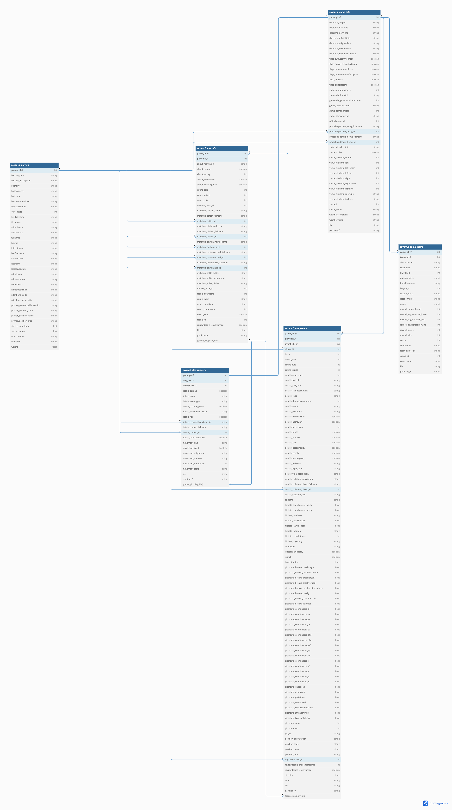

# Baseball Zavant

A clone of some statistical tables presented on [MLB's Baseball Savant](https://baseballsavant.mlb.com/). All data is queried from the [MLB Stats API](https://statsapi.mlb.com) and ETL'd from scratch using Python and PySpark. Output player pages (front-end dev in progress) are hosted on AWS.

## Datamart Pipeline

This is a transformation pipeline that runs on several AWS services to extract/transform/load data from the MLB Stats API and massage it into a useful format for analytics. The raw game data, [as it comes out of the API](https://github.com/zpgallegos/zavant/blob/master/docs/readme/744863.json), is overly detailed, heavily nested, and generally difficult to work with. The pipeline takes it from this cumbersome format to a set of datamart tables that are easy to produce data products from.

A high-level overview of the pipeline is as follows:

1. **Download from API**: A [Lambda function](https://github.com/zpgallegos/zavant/blob/master/landing/statsapi/aws/lambda/zavant-download-games/function/lambda_function.py) runs nightly, downloading any new games that are not already present in the S3 bucket for raw game files.
2. **Flatten and Preprocess the Game Data**: The raw game files need to be picked apart and flattened before they'll be useful for anything. Upon landing in the raw bucket, a [second Lambda function](https://github.com/zpgallegos/zavant/blob/master/landing/statsapi/aws/lambda/zavant-process-raw-game/function/lambda_function.py) will run on event trigger to preprocess the file into a flat structure, saving several files to their own dedicated buckets in the process.
3. **Spark Transformation**: A [PySpark script](https://github.com/zpgallegos/zavant/blob/master/landing/statsapi/aws/glue/statsapi_convert_json_to_parquet.py) runs to transform the processed data into its final structure, convert to Parquet, and do an incremental load of any new files into the datamart tables. The tables are:
    * D_PLAYERS: player attributes as recorded in their most recently played game
    * D_GAME_INFO: game-specific information such as date, venue, probable pitchers, etc.
    * D_GAME_TEAMS: team attributes for each of the two participant teams in each game
    * F_PLAY_INFO: fact table for the individual plays and their outcomes that together compose the game
    * F_PLAY_EVENTS: fact table recording granular data for the events composing a play (pitches, hits, pickoffs, reviews, etc.)
    * F_PLAY_RUNNERS: fact table recording all runner movement on each play
4. (Runs once) AWS Glue crawlers are configured to crawl the datamart bucket and populate tables in the Glue Data Catalog, making the data available for BI purposes (e.g., Athena queries).

**Datamart Model**

[View on dbdiagram.io](https://dbdiagram.io/d/zavant_datamart-662ecbda5b24a634d003db68)  

## BI

_switches hats_

A [simple Nuxt app](https://github.com/zpgallegos/zavant/tree/master/web) is used to create files for the root site and player leaf pages to be hosted as static sites on S3. See [Mookie's page](http://zavant.zgallegos.com/players/605141/), for example.

## Copyright Notice

This repo and its author are not affiliated with MLB or any MLB team. The code in this repo interfaces with MLB's Stats API. Use of MLB data is subject to the notice posted [here](http://gdx.mlb.com/components/copyright.txt).
