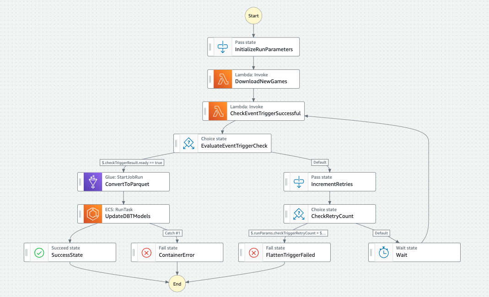

# Baseball Zavant

This repo is an ongoing baseball analytics project inspired by [MLB's Baseball Savant](https://baseballsavant.mlb.com/). See [an example player page](http://zavant.zgallegos.com/players/605141), or find your favorite player in [the directory](http://zavant.zgallegos.com/).

All products are built from [live game data](https://github.com/zpgallegos/zavant/blob/master/docs/example-game-raw.json), queried and ETL'd from scratch from the [MLB Stats API](https://statsapi.mlb.com). (See the [copyright notice](#copyright-notice).)

The [front end](https://github.com/zpgallegos/zavant/tree/master/app) is built with **React**, with plots powered by **D3.js**.

The back end is built on **AWS** and makes use of a variety of services, including:

-   **Lambda** for nightly downloads of new data from the API and for basic preprocessing (e.g., unnesting)
-   **S3** as a data lake for raw and processed data and for other general object storage
-   **Glue** for running scheduled Spark scripts/crawlers and for the data catalog as a central metadata store
-   **Athena** as the source database for the **dbt** project and for interactive queries
-   **Step Functions** for orchestration of the nightly data pipeline
-   The **AWS CLI** for local testing/development and deployment

## Data Download and Transformation Pipeline

The raw data, [as it comes out of the API](https://github.com/zpgallegos/zavant/blob/master/docs/example-game-raw.json), is overly detailed, heavily nested, and generally difficult to work with for analytics purposes. This pipeline takes the data from the API into a minimally processed form in the S3 data lake, where it can be crawled and stored as a set of tables with baseball-logical organization. These tables are used as sources in the dbt project that produces the final marts and products.

The steps are:

1. **Download from API**: A [Lambda function](https://github.com/zpgallegos/zavant/blob/master/landing/statsapi/aws/lambda/zavant-download-games/function/lambda_function.py) runs nightly, downloading any new games that are not already present in the S3 bucket for raw game files.
2. **Flatten and preprocess the game data**: The raw game files need to be picked apart and flattened before they'll be useful for anything. Upon landing in the raw bucket, a [second Lambda function](https://github.com/zpgallegos/zavant/blob/master/landing/statsapi/aws/lambda/zavant-process-raw-game/function/lambda_function.py) will run on event trigger to preprocess the file into a flat structure, selecting several pieces of the object, unnesting where needed, and saving them to their own respective prefixes in a separate processed bucket.
3. **Apply set schemas and convert to Parquet with season partitions**: A [PySpark script](https://github.com/zpgallegos/zavant/blob/master/landing/statsapi/aws/glue/statsapi_convert_json_to_parquet.py) runs in a scheduled Glue ETL job that applies a predefined schema on read, converts the JSON to Parquet, and does an incremental load of any new files into the processed Parquet data lake. The data is partitioned by season to match query intent.
4. **Crawl lake for metadata**: Glue crawlers are configured to crawl the data lake and populate tables in the Glue Data Catalog, making it available for use by other services (e.g., Athena). Since schemas are predefined (the data is slow-changing), this step only needs to run once. The resulting tables are:
    - gane_players: player attributes as recorded at the time of each game
    - game_info: game-specific information such as date, venue, probable pitchers, etc.
    - game_teams: team attributes for each of the two participant teams in each game
    - play_info: detailed data for the individual plays and their outcomes that together compose the game (e.g., single, walk, flyout, etc.)
    - play_events: granular data for the events composing a play (pitches, hits, pickoff attempts, umpire reviews, etc.)
    - play_runners: records all runner movement on each play

**Data Model**

[View on dbdiagram.io](https://dbdiagram.io/d/zavant_datamart-662ecbda5b24a634d003db68)

## Copyright Notice

This repo and its author are not affiliated with MLB or any MLB team. The code in this repo interfaces with MLB's Stats API. Use of MLB data is subject to the notice posted [here](http://gdx.mlb.com/components/copyright.txt).
