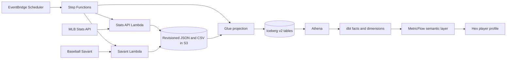

# Baseball Zavant

**A deployed MLB analytics platform that turns revision-aware API data into
tested facts, governed metrics, and an interactive player-profile product.**

Zavant is an end-to-end analytics engineering portfolio project. It retains the
source evidence required to reproduce every result, projects grain-specific
Iceberg tables, models reusable analytical facts in dbt, defines its metrics in
MetricFlow, and serves the resulting product through Hex.

> **Live product:** [Explore the published Hex player profile](https://app.hex.tech/01a00124-662e-7369-982a-ba58e4f2a22f/app/0347rXGBaRqd4gD8KHxHRr/latest)
>
> [Review the semantic layer](dbt/) ·
> [Inspect the data platform](docs/data-platform.md) ·
> [Read the presentation methodology](docs/hex-methodology.md)

## What this project demonstrates

| Surface | Verifiable evidence |
|---|---|
| Analytical product | An interactive player profile built from governed batting and contact-quality metrics. |
| Semantic layer | Source-controlled MetricFlow entities, dimensions, additive measures, ratios, and derived metrics. |
| Analytics engineering | Tested dbt staging, intermediate, fact, and dimension models with explicit grains and correction-safe incremental merges. |
| Data engineering | Resumable schedule discovery, historical backfills, correction polling, immutable raw revisions, and current-state reconciliation. |
| Cloud architecture | EventBridge Scheduler, Step Functions, Lambda, S3, Glue, Iceberg v2, the Glue Catalog, Athena, IAM, and CloudFormation. |
| Reliability | Boundary contracts, idempotent writes, independent watermarks, durable run manifests, reconciliation tests, and completeness reporting. |

## End-to-end architecture


```mermaid
flowchart LR
    api[MLB Stats API]
    savant[Baseball Savant]
    scheduler[EventBridge Scheduler]
    workflow[Step Functions]
    stats_lambda[Stats API Lambda]
    savant_lambda[Savant Lambda]
    raw[(Revisioned JSON and CSV in S3)]
    glue[Glue projection]
    iceberg[(Iceberg v2 tables)]
    athena[Athena]
    dbt[dbt facts and dimensions]
    metricflow[MetricFlow semantic layer]
    hex[Hex player profile]

    scheduler --> workflow
    workflow --> stats_lambda
    workflow --> savant_lambda
    api --> stats_lambda
    savant --> savant_lambda
    stats_lambda --> raw
    savant_lambda --> raw
    workflow --> glue
    raw --> glue
    glue --> iceberg
    iceberg --> athena
    athena --> dbt
    dbt --> metricflow
    metricflow --> hex
```

The scheduled production workflow currently coordinates acquisition and Glue
projection. dbt publication and Hex semantic synchronization remain explicit
deployment boundaries rather than being implied as steps in that state machine.

## Design highlights

- Exact MLB responses are retained as immutable evidence with request
  provenance and content-addressed game revisions.
- Baseball Savant acquisition is isolated behind its own all-player,
  one-date CSV client, Lambda, date revisions, run manifests, and watermark.
- Schedule discovery, deferred-game processing, and corrected-game polling use
  independently advancing durable state, so one failure does not erase other
  successful work.
- Glue reconciles durable current-revision pointers rather than trusting only
  the games mentioned by the preceding daily run.
- Analytical event families are projected at their natural grains instead of
  forcing pitches, runner movements, actions, and batted balls into one sparse
  table.
- dbt facts replace complete revised games during Iceberg merges, including
  deletion of rows removed by a source correction.
- Baseball rates are ratios of additive aggregate components, preventing the
  average-of-averages errors that arise when precomputed row-level rates are
  regrouped.
- The Hex connection uses temporary AWS credentials and a dedicated,
  cost-bounded Athena workgroup rather than embedded long-lived credentials.

## Repository map

| Path | Responsibility |
|---|---|
| [`src/zavant/ingestion`](src/zavant/ingestion/) | Shared HTTP boundaries plus isolated MLB Stats API and Baseball Savant clients, contracts, workflows, stores, and Lambda handlers. |
| [`src/zavant/storage`](src/zavant/storage/) | Source-neutral artifact references and local/S3 path primitives. |
| [`src/zavant/projection`](src/zavant/projection/) | Explicit JSON projections, analytical contracts, Iceberg reconciliation, and current views. |
| [`infrastructure`](infrastructure/) | CloudFormation for acquisition, analytical projection, orchestration, and Hex access. |
| [`dbt`](dbt/) | Staging, grain-first intermediates, facts, dimensions, tests, and MetricFlow definitions. |
| [`scripts/monitoring`](scripts/monitoring/) | Daily-run inspection, Glue-run inspection, and warehouse-completeness reporting. |
| [`tests`](tests/) | Contract, workflow, storage, projection, infrastructure, and recovery behavior. |

## Technology

Python 3.12 · AWS Lambda · Step Functions · EventBridge Scheduler · S3 · AWS
Glue · Apache Iceberg v2 · Glue Data Catalog · Athena · dbt · MetricFlow · Hex ·
CloudFormation · GitHub Actions

## Development and operations

The sections below are the implementation and operating guide. The
[data-platform case study](docs/data-platform.md) and
[semantic-layer case study](dbt/) provide shorter, design-oriented walkthroughs.

### Local development

From this directory:

```shell
make bootstrap PYTHON=/path/to/python3.12
make check
```

If `python3` already points to Python 3.11 or newer, `make bootstrap` is sufficient. Bootstrap installs the package and its runtime dependencies into `.venv`. Local outputs are written under `.local/` and ignored by Git.

Copy `.env.example` to the ignored `.env` file for local configuration. Make
loads that file automatically and maps its `ZAVANT_*` values to infrastructure
parameters; the wrappers under `scripts/adhoc/` source the same file. Explicit
Make arguments and variables supplied directly to a test script override those
defaults.

The separation is intentional: `.env` contains values that describe a local or
deployed environment, including AWS account, Region, deployment name, S3
location, bootstrap boundaries, schedule, and projection sizing. The Makefile
contains tool names, repository paths, artifact names, and stack names derived
from the deployment environment.

The acquisition workflows create these layouts:

```text
.local/lake/
├── raw/mlb_stats_api/
│   ├── games/season=2024/game_pk=744863/
│   │   ├── revision=<canonical-sha256>/
│   │   │   ├── game.json
│   │   │   └── metadata.json
│   │   └── current.json
│   ├── schedules/request_date=2026-08-09/
│   │   └── run_id=00000000-0000-0000-0000-000000000002/
│   │       ├── response.json
│   │       ├── metadata.json
│   │       └── manifest.json
│   └── game_changes/poll_date=2026-08-09/
│       └── run_id=00000000-0000-0000-0000-000000000001/
│           ├── page=0000/
│           │   ├── response.json
│           │   └── metadata.json
│           └── manifest.json
├── state/mlb_stats_api/
│   ├── game_changes/watermark.json
│   └── schedules/watermark.json
├── raw/baseball_savant/statcast_search/
│   └── game_date=2026-08-08/
│       ├── revision=<response-sha256>/
│       │   ├── response.csv
│       │   └── metadata.json
│       └── current.json
├── state/baseball_savant/statcast_search/watermark.json
├── runs/daily/run_date=2026-08-09/
│   └── run_id=<uuid>/manifest.json
├── runs/baseball_savant/daily/run_date=2026-08-09/
│   └── run_id=<uuid>/manifest.json
└── runs/baseball_savant/backfill/run_date=2026-08-09/
    └── run_id=<uuid>/manifest.json
```

Historical reconciliation adds parent manifests under `runs/backfill/`,
season-scoped checkpoints under `state/mlb_stats_api/backfills/`, and dedicated
correction evidence under `raw/mlb_stats_api/backfill_game_changes/`.

`game.json` and both kinds of `response.json` retain the exact source bytes. A game revision ID is a SHA-256 digest of canonical JSON, so whitespace and object-key order do not create false revisions. `current.json` advances when a new revision is first landed and is not rolled backward if an older known revision is replayed. Schedule and change manifests deduplicate game IDs and initially mark each one `pending` for their respective downstream workflows.

## MLB API client

[`MlbStatsApiClient`](src/zavant/ingestion/mlb_stats_api/client.py) provides typed methods for the three public resources currently in scope:

- `get_schedule(start_date, end_date, sport_id=1)`
- `get_game_changes(updated_since, sport_id=1, limit=1000, offset=0)`
- `get_live_game(game_pk)`

The client returns exact response bytes and HTTP provenance; the contract classes validate the resource-specific JSON afterward. Its standard-library transport is replaceable in tests, each request has an explicit timeout, and retry behavior is bounded and configurable.

[`BaseballSavantClient`](src/zavant/ingestion/baseball_savant/client.py) is a separate
source client that can request only one regular-season game date at a time. The
daily Savant process requests all players, validates the current CSV schema and
observed 25,000-row limit, lands exact response bytes, and reacquires a rolling
seven-date window. The Glue projection publishes terminal batting outcomes to
revision-aware Iceberg history and exposes current date revisions through
`current_statcast_batting_events`.

## Baseball Savant backfills

Backfill an inclusive historical date range with the same
one-date, all-player request and immutable raw store used by daily Savant
acquisition:

```shell
PYTHONPATH=src .venv/bin/python -m zavant backfill-savant \
  --start-date 2025-03-27 \
  --end-date 2025-09-28
```

The default `missing` mode skips dates that already have a current raw
revision. Use `--mode verify` to reacquire every date and let content addressing
identify unchanged responses or create new revisions. Requests are sequential
and have a configurable 0.5-second delay; use `--request-delay-seconds` to
change it. `--dry-run` writes the plan without making source requests.

Backfill manifests are separate from daily manifests under
`runs/baseball_savant/backfill/`. The command never reads or advances the daily
Savant watermark. To resume only the failed dates from an interrupted or
partially failed run, supply the `run_id` and `started_at` printed by the first
invocation with the same range, mode, and request delay:

```shell
PYTHONPATH=src .venv/bin/python -m zavant backfill-savant \
  --start-date 2025-03-27 \
  --end-date 2025-09-28 \
  --run-id <previous-run-id> \
  --started-at <previous-started-at>
```

Storage defaults to `.local/lake`; select another local root with `--data-dir`.
Production S3 writes must be requested explicitly and are guarded by the same
STS account check as Stats API backfills:

```shell
export ZAVANT_S3_BUCKET=<AcquisitionBucketName-output>
export ZAVANT_AWS_ACCOUNT_ID=<12-digit-account-id>
PYTHONPATH=src .venv/bin/python -m zavant backfill-savant \
  --start-date 2018-03-29 \
  --end-date <last-complete-date> \
  --storage s3
```

In either backend, the end date must be before the current UTC date so the
backfill cannot capture an incomplete current-day export.

## Bounded game acquisition

Download a bounded range from the live API with:

```shell
PYTHONPATH=src .venv/bin/python -m zavant acquire-games \
  --start-date 2024-03-20 \
  --end-date 2024-03-20
```

The workflow:

1. Captures and lands the exact bounded schedule response.
2. Classifies every discovered game with the explicit final-regular-season policy.
3. Downloads and validates every eligible complete live-game response.
4. Lands each response through the revision-aware raw-game store.
5. Atomically records per-game attempts and the final run summary in the schedule manifest.

Final regular-season games are acquired, unfinished regular-season games are `deferred`, and other game types are `skipped`. Individual download or validation failures are recorded as `failed` without preventing independent games from running. The command exits with status 1 when any game failed.

The command prints its generated `run_id` and `requested_at`. Supply both values with the same date range to resume that exact run:

```shell
PYTHONPATH=src .venv/bin/python -m zavant acquire-games \
  --start-date 2024-03-20 \
  --end-date 2024-03-20 \
  --run-id <previous-run-id> \
  --requested-at <previous-requested-at>
```

A resume reads the persisted schedule instead of requesting a potentially changed snapshot. It retries pending and failed games while leaving succeeded, skipped, and deferred entries unchanged.

## Corrected-game polling

Bootstrap the correction feed once with an explicit last-known-safe timestamp:

```shell
PYTHONPATH=src .venv/bin/python -m zavant poll-game-changes \
  --initial-watermark 2024-03-20T00:00:00Z
```

Every later run reads its checkpoint from `.local/lake/state/mlb_stats_api/game_changes/watermark.json`, so `--initial-watermark` must be omitted:

```shell
PYTHONPATH=src .venv/bin/python -m zavant poll-game-changes
```

The poller captures its new checkpoint before making a request, subtracts a five-minute safety overlap from the prior checkpoint, follows the source's offset pagination, and lands every response page. It rejects changing totals or repeated games observed across pages before checkpoint advancement. MLB does not expose an upper query boundary or document snapshot isolation, so this detects common result-set movement but cannot prove a perfectly stable source snapshot. It then validates and marks the run manifest `complete` before atomically replacing the watermark document. Any request, validation, landing, or finalization failure leaves the old watermark unchanged; already landed pages remain as evidence in an `open` manifest.

The overlap intentionally allows a game to appear again in later polls. Manifests deduplicate game IDs, and raw-game content addressing makes reprocessing idempotent. The daily workflow processes every completed correction manifest containing pending or failed games. Only games with an existing raw revision are re-downloaded; schedule discovery remains the sole owner of initial portfolio inclusion. Per-game failures remain retriable in the source correction manifest.

The default page size is 1,000, the safety guard is 100 pages, and the overlap is 300 seconds. These can be overridden with `--limit`, `--max-pages`, and `--overlap-seconds`.

## Daily local workflow

Bootstrap both independent discovery checkpoints once:

```shell
PYTHONPATH=src .venv/bin/python -m zavant run-daily \
  --initial-schedule-date 2024-03-20 \
  --initial-correction-watermark 2024-03-20T00:00:00Z
```

Then run the same workflow daily without bootstrap arguments:

```shell
PYTHONPATH=src .venv/bin/python -m zavant run-daily
```

Each invocation records four independent branches in `runs/daily/.../manifest.json`:

1. Poll and durably checkpoint corrected-game discovery.
2. Retry all pending or failed corrected games that already exist in storage.
3. Reconsider every game in the durable deferred-game worklist.
4. Discover the schedule through the current UTC date and acquire newly final regular-season games.

The schedule branch keeps its own successful through-date and, by default,
re-queries a rolling seven-day window. That window cheaply discovers recent
schedule changes. It is not the correctness boundary for unfinished games:
every deferred regular-season game is also retained in
`state/mlb_stats_api/schedules/deferred_games.json` and its live feed is checked
on each daily run until the game is final or cancelled. Final games that already
have a current raw revision are resolved from persisted state without another
live-feed request. Use `--schedule-lookback-days` to tune the discovery window
and `--through-date` for a deterministic local run.

A failure in one branch does not prevent the others from running. The command exits with status 1 if any branch fails, while each successful discovery watermark advances independently. An immediate rerun therefore retries only the state that remains outstanding. If only one checkpoint was initialized during a partially successful bootstrap, supply only the missing branch's bootstrap argument on the next run.

## Historical season backfills

The backfill workflow divides each requested season into twelve bounded monthly
schedule runs, applies the same final-regular-season eligibility policy as daily
acquisition, and lands selected games through the same immutable revision store.
The recommended mode is `reconcile`:

```shell
export ZAVANT_S3_BUCKET=<AcquisitionBucketName-output>
export ZAVANT_AWS_ACCOUNT_ID=<12-digit-account-id>
PYTHONPATH=src .venv/bin/python -m zavant backfill-statsapi \
  2019 2020 2021 --mode reconcile --storage s3
```

Storage defaults to `.local/lake` even when an S3 bucket is present in the
environment. Cloud backfills require explicit `--storage s3`, a bucket, and an
expected AWS account ID supplied to the process environment. Credentials remain
owned by the normal AWS SDK credential chain.

The three modes have intentionally different costs and guarantees:

- `missing` downloads only eligible games with no current raw revision and does
  not advance a correction checkpoint.
- `reconcile` downloads missing games plus existing games reported by MLB's
  public `game/changes` feed since that season's independent checkpoint.
- `verify` downloads every eligible game and lets content addressing determine
  whether each response is a new revision. This is the public-API absolute audit
  and is expected to be used occasionally rather than daily.

MLB documents `game/changes` for corrected non-metric game data; it is not a
complete Statcast/metric revision signal. For that reason, `reconcile` is the
practical routine mode while `verify` is the stronger audit.

Add `--dry-run` to request schedules (and correction discovery when needed) and
persist a plan without downloading games or advancing checkpoints. Failed games
remain retriable. Resume the exact run without repeating completed monthly
schedules or completed correction discovery by supplying the `run_id` and
`started_at` printed by the first invocation:

```shell
PYTHONPATH=src .venv/bin/python -m zavant backfill-statsapi 2021 \
  --mode reconcile \
  --run-id <previous-run-id> \
  --started-at <previous-started-at>
```

Each season advances its own checkpoint only after all twelve monthly manifests
finish without game failures. The daily correction watermark is never read or
modified by this workflow.

Progress is emitted to stderr at run, season, and month boundaries. A season
cannot complete when it is future-dated, empty, has no eligible games, or leaves
regular-season games unresolved in a deferred state. The parent manifest records
unique scheduled and eligible counts, duplicate schedule entries, and unresolved
game IDs. Resumption also recognizes a checkpoint already committed by the same
run, closing the crash window between checkpoint and parent-manifest publication.

## S3 and Lambda application boundary

The production Stats API handler is
`zavant.ingestion.mlb_stats_api.lambda_handler.lambda_handler`. It composes the
same API client, persistence state machines, and daily coordinator used locally,
replacing only the object-storage machinery. Required Lambda configuration
starts with:

```text
ZAVANT_S3_BUCKET=<bucket-name>
ZAVANT_S3_PREFIX=lake
ZAVANT_INITIAL_SCHEDULE_DATE=<first-schedule-date>
ZAVANT_INITIAL_CORRECTION_WATERMARK=<first-known-safe-UTC-timestamp>
ZAVANT_SAVANT_INITIAL_DATE=<first-daily-savant-date>
```

The bucket is deliberately not created by the application. Its private,
encrypted, versioned CloudFormation definition, prefix-scoped execution role,
Lambda function, and retention-controlled log group live in
[`infrastructure/acquisition-stack.yaml`](infrastructure/acquisition-stack.yaml);
packaging and deployment instructions are in
[`infrastructure/README.md`](infrastructure/README.md). The Lambda role can list
only the configured prefix and read or write only its objects; it cannot delete
data or administer the bucket. The
[daily workflow stack](infrastructure/daily-workflow.md) owns EventBridge
Scheduler, its start-execution role, and the Step Functions state machine that
invokes acquisition and waits for Glue. Glue still reconciles durable revisions
after a partial acquisition failure, and the workflow then reports that retained
failure. The schedule defaults to 6:00 AM
`America/Los_Angeles` and follows daylight-saving time. Credentials are supplied
by execution roles, never environment variables.

The optional source-specific event boundaries support deterministic smoke tests:

```json
{
  "through_date": "2026-08-09",
  "savant_through_date": "2026-08-08"
}
```

The Savant boundary must be earlier than the current UTC date so an explicit
override cannot publish an incomplete current-day export.

Bootstrap configuration is consulted only while its corresponding watermark is absent. Thereafter the persisted S3 state is authoritative. If any daily branch fails, its manifest remains in S3 and the handler raises so the Lambda invocation is visibly unsuccessful.

The deployed path includes historical reconciliation, production API-to-raw
Lambda acquisition, Glue-to-Iceberg projection, scheduled Step Functions
orchestration, business-grained dbt facts and dimensions, and MetricFlow
semantic models for plate appearances, batted balls, pitches, runner movements,
player-game participation, players, and teams. Hex synchronizes those
definitions from source control and uses a separate stack for its cost-bounded
Athena workgroup, expiring query-result storage, and temporary-credential
production warehouse role. The published player profile currently presents
traditional batting and contact-quality results; pitch analysis is the next
presentation slice. Workflow alarms remain a later operational layer.

## Local analytical projection

Project every raw revision selected by a local `current.json` pointer into the
analytical datasets:

```shell
PYTHONPATH=src .venv/bin/python -m zavant project-local
```

Use repeated `--season` options to limit the input, or `--output-dir` to choose
a new destination. By default, each invocation writes a unique run below
`.local/lake/analytical/projection_runs/`. A completed run contains one Parquet
file for each of the 25 contracted datasets, along with `manifest.json`,
`schemas.json`, and small JSON samples for convenient inspection. The tables
cover game context, teams and innings; the play/event spine; sparse pitch,
batted-ball, action, substitution, disengagement, non-pitch, review, and rule
violation families; runner movements and fielding credits; and game-scoped
player, position, player-statistic, and team-statistic data.

Every immutable content-addressed revision is eligible. Legacy unversioned
`game_pk=<id>/game.json` files are not assigned invented provenance; a run lists
any such ignored files in its manifest so the exclusion is visible.

Every analytical row carries the content-addressed source revision, projection
contract version, run ID, and projection timestamp. The event table is a skinny
sequence-preserving spine; sparse event families and ordered child records live
at their own grains. Embedded season-to-date player statistics are deliberately
excluded in favor of the game boxscore statistics. Local output is an
inspection and contract-testing boundary. Production uses the same projection
contracts in a Glue job that reconciles raw revisions into Iceberg tables;
the scheduled Step Functions workflow runs that job after daily acquisition.

Project local Savant backfill revisions independently with:

```shell
PYTHONPATH=src .venv/bin/python -m zavant project-savant-local \
  --start-date 2025-03-27 \
  --end-date 2025-09-28
```

This source-specific command writes `statcast_batting_events` and the
`statcast_dates` completion-marker table below a unique local run directory.
Only terminal CSV rows are projected because those rows carry the batting
outcome and expected-stat values; the Stats API local projection contract is
left unchanged.

See the [target architecture](docs/architecture/target-architecture.md),
[decision register](docs/architecture/README.md), and
[migration roadmap](docs/migration-roadmap.md) for the design, decisions, and
implementation history from acquisition through semantics and presentation.
